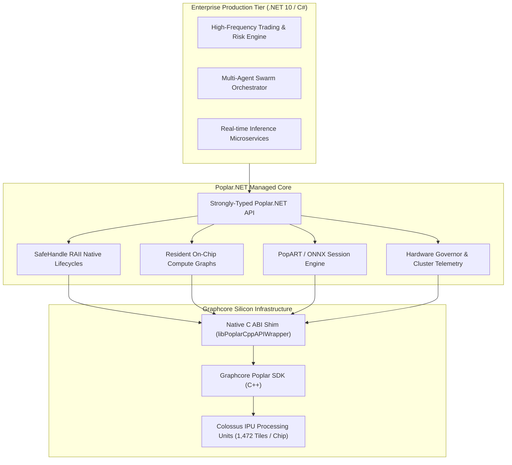

# Poplar.NET — Enterprise .NET 10 Runtime & Resident Graph Engine for Graphcore IPUs

[](LICENSE)
[](https://dotnet.microsoft.com/download)
[](https://www.graphcore.ai/)
[](WHITEPAPER.md)

`Poplar.NET` is the world's first production-grade, zero-allocation **C# / .NET 10 runtime engine and graph orchestration SDK** for **Graphcore Colossus IPUs** (Bow-2000, Bow Pod, MK2 IPU-POD, and IPU-M2000 clusters).

Designed for high-throughput quantitative finance, algorithmic trading, latency-critical microservices, and distributed AI infrastructure, `Poplar.NET` enables enterprise .NET developers to build, compile, and dispatch resident compute graphs directly to Graphcore IPUs with zero Python overhead.

---

## 📑 Technical Whitepaper

Read the full technical whitepaper: [**`WHITEPAPER.md`**](WHITEPAPER.md)  
*Covers architectural principles, zero-allocation benchmarks, resident graph specifications, and enterprise integration.*

---

## 🏛️ Architecture Overview



---

## 🌟 Key Capabilities

### 1. High-Throughput Resident Graphs
Pre-compiled, on-chip IPU graphs engineered for extreme low-latency execution:
- **LLM Components**: Matrix multiplication, Attention projection, and SwiGLU forward passes (`PoplarResidentGraphs.CreateLlmComponentGraph`).
- **Optimization & Swarm Intelligence**: Hardware-accelerated Particle Swarm (`CreatePsoVelocityGraph`), Differential Evolution (`CreateDeMutationGraph`), and Ant Colony optimization.
- **Financial & Statistical Math**: Real-time covariance matrix tracking (`CreateCmaesCovarianceGraph`) and Knowledge Graph Embeddings (`CreateKgeGraph`).

### 2. Native PopART & ONNX Model Execution
- Direct C# bindings for creating inference and training sessions with Graphcore's PopART engine.
- Zero-copy weight transfer and host-to-device FIFO stream synchronization.

### 3. Enterprise Hardware Governance & Telemetry
- **`IpuFanGovernor`**: Dynamic thermal regulation and fan profile management for high-load clusters.
- **`PoplarResidencyTelemetry`**: Real-time monitoring of tile memory footprint and compute efficiency telemetry.
- **RDMA Streaming**: Direct InfiniBand/RoCE streams for distributed IPU-POD configurations.

---

## 📦 Binary Distribution & Evaluation

Pre-compiled runtime binaries (`HFLabs.Poplar.NET.dll` and `libPoplarCppAPIWrapper.so`) are distributed as release assets:
- **GitHub Release**: [Download `Poplar.NET-v1.0.0-preview-binaries.zip`](https://github.com/hf-laboratories/Poplar.NET/releases/tag/v1.0.0-preview)

The binaries are closed source and are free to use for evaluation and non-commercial research. Production and commercial use need a commercial license. See [LICENSE](LICENSE).

---

## 🚀 Quick Start Example

### Basic Graph Construction & Execution
```csharp
using HFLabs.Poplar;

// 1. Enumerate and acquire an available Graphcore IPU device (or IPU Model for simulation)
using var device = PoplarDevice.AcquireAvailable(deviceCount: 1);

// 2. Construct a computational graph with strongly-typed tensor shapes
using var graph = new PoplarGraph(device.Target);
var a = graph.AddVariable(PoplarDataType.Float, [1024, 1024], "tensor_a");
var b = graph.AddConstant(PoplarDataType.Float, [1024, 1024], 1.5f, "tensor_b");

// 3. Compile and load into the IPU execution engine
using var program = graph.CreateSequence();
using var engine = new PoplarEngine(graph, program);
engine.Load(device);

// 4. Run zero-allocation execution
engine.Run(0);
```

### Managing IPU Clusters with PowerShell (`PSPoplar`)
```powershell
Import-Module ./examples/PSPoplar/PSPoplar.psd1

# Query connected IPU devices and telemetry
Get-PoplarDeviceInfo
Get-PoplarTelemetry -DeviceId 0

# Test IPU fan controller governor
Start-IpuThermalGovernor -TargetTempCelsius 65
```

---

## 💼 Sponsorship & Commercial Licensing

`Poplar.NET` is actively maintained by **HF Laboratories**.

For partnership inquiries, please contact: `alix@HFLabs.dev`.

---

## 📄 License

- **Binaries** (`HFLabs.Poplar.NET.dll`, `libPoplarCppAPIWrapper.so`): proprietary, closed source. Free for evaluation and non-commercial research. Commercial use needs a license. See [LICENSE](LICENSE).
- **Contracts and examples** (`src/Poplar.NET.Contracts/`, `examples/`): Apache-2.0. See [LICENSE-APACHE-2.0](LICENSE-APACHE-2.0).
- **Documentation and whitepaper**: all rights reserved. You may read and link to them.
- **Earlier copies:** the v1.0.0-preview binaries were released under Apache-2.0, and recipients keep those rights.

## Trademarks and non-affiliation

Product and company names in this repository belong to their owners and are used only to say what this project works with. HF Laboratories is not affiliated with, endorsed by, or sponsored by any of them.

- Graphcore, IPU, Colossus, Poplar, PopART are trademarks or registered trademarks of Graphcore Limited.
- Microsoft, .NET, PowerShell are trademarks or registered trademarks of Microsoft Corporation.
- ONNX, PyTorch are trademarks or registered trademarks of The Linux Foundation.

See [hflabs.dev/legal/trademarks](https://hflabs.dev/legal/trademarks) for the full list.
