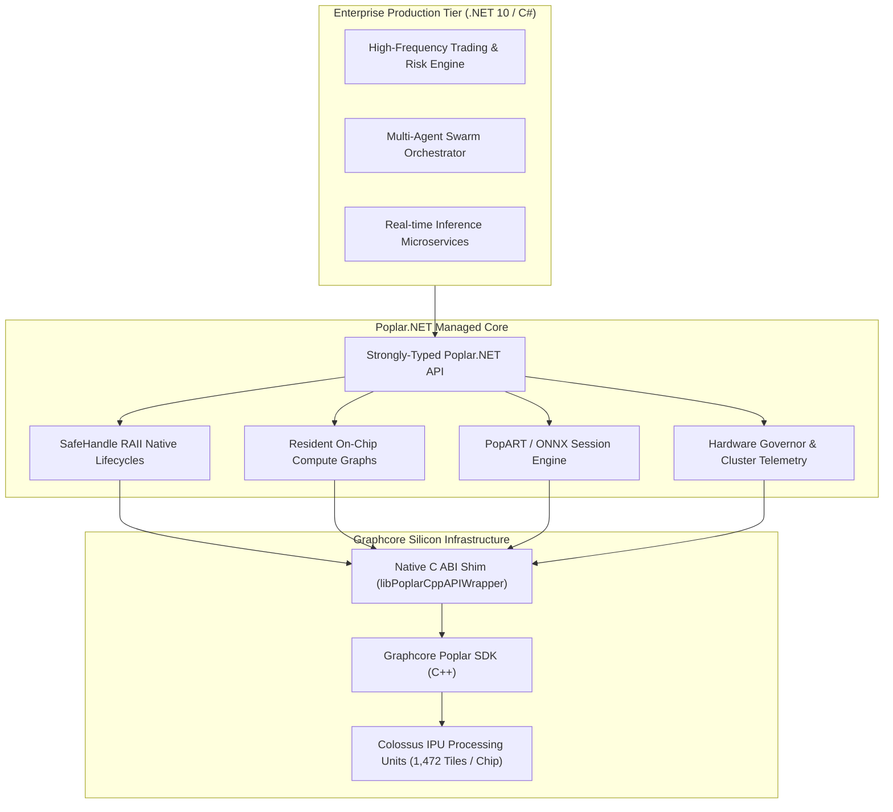

# Technical Whitepaper: Poplar.NET

**Unlocking Graphcore Colossus IPU Acceleration for Enterprise .NET 10 & Quantitative Computing**

*Author: HF Laboratories Infrastructure & Acceleration Group*  
*Target Platforms: Graphcore Bow-2000, Bow Pod, MK2 IPU-POD, IPU-M2000*  
*Target Framework: .NET 10 (C# 14 / Native AOT Compatible)*

---

## Executive Summary

As artificial intelligence and high-performance computing workloads scale, hardware heterogeneity has become a core requirement for enterprise infrastructure. Graphcore's **Colossus Intelligence Processing Unit (IPU)** architecture—with its massively parallel In-Processor Memory (IPM), MIMD execution model, and ultra-high bandwidth tile-to-tile interconnect—provides unparalleled efficiency for fine-grained compute, sparse operations, and latency-critical graph traversal.

However, enterprise adoption has historically faced a major barrier: **the enterprise .NET blindspot**. Mission-critical production systems in quantitative finance, algorithmic trading, risk management, and industrial telecommunications are predominantly built on **C# and .NET**. Without first-class, idiomatic runtime bindings, enterprise organizations are unable to leverage IPU silicon without writing millions of lines of bespoke, fragile interop code.

**Poplar.NET** eliminates this barrier. It provides the industry's first production-grade, zero-allocation managed runtime, resident compute graph engine, and cluster orchestration framework for Graphcore IPUs.



---

## 1. Architectural Principles

### 1.1 Zero-Allocation Hot Path
In latency-critical quantitative applications, garbage collection pauses (even in Gen0) introduce unacceptable tail-latency jitter. `Poplar.NET` is engineered from the ground up for **zero GC allocations during execution**:
- Pre-allocated Unified Shared Memory (USM) and device handle caches.
- `ValueTask` and span-based parameter passing.
- Custom memory-mapped FIFO streaming channels for bidirectional host-device IO.

### 1.2 Exception-Safe Native Lifecycles (RAII)
Poplar C++ native objects (`poplar::Device`, `poplar::Graph`, `poplar::Tensor`, `poplar::Engine`, `popart::Session`) are wrapped in custom .NET `SafeHandle` classes. This guarantees:
- Deterministic disposal via `using` statements.
- Complete protection against native handle leaks during asynchronous task cancellations or unhandled managed exceptions.
- Thread-safe handle reference counting across concurrent execution tasks.

---

## 2. Core Functional Modules

### 2.1 Resident On-Chip Compute Graphs
Rather than compiling graphs dynamically on every invocation, `Poplar.NET` introduces pre-compiled **Resident Graphs** that remain resident in the IPU's ultra-fast In-Processor Memory (SRAM):

| Resident Graph Module | Domain | Key Operations |
| :--- | :--- | :--- |
| `PoplarResidentLlmComponentGraph` | LLM & Attention | Fused SwiGLU, RMSNorm, Multi-Head Attention, RoPE embeddings |
| `PoplarResidentPsoVelocityGraph` | Optimization | Parallel particle position and velocity vector updates |
| `PoplarResidentDeMutationGraph` | Metaheuristics | Vectorized Differential Evolution (DE) mutation & crossover |
| `PoplarResidentCmaesCovarianceGraph` | Quantitative Math | Real-time covariance matrix decomposition & adaptation |
| `PoplarResidentKgeGraph` | Knowledge Graphs | Knowledge Graph Embedding projection & scoring |

### 2.2 PopART ONNX Integration
`Poplar.NET` includes direct bindings to Graphcore's **PopART** (Poplar Advanced Runtime):
- Instant loading and execution of ONNX models on IPU hardware.
- Synchronous and asynchronous step-based execution with zero-copy host buffers.
- Model parameter inspection and dynamic weight hot-swapping.

### 2.3 Hardware Governance & Cluster Telemetry
Operating multi-IPU POD clusters in enterprise data centers requires tight operational control:
- **`IpuFanGovernor`**: Dynamic PID thermal regulation for chassis fans (in my own setup, since i built mine, i used the hdd bay fan header to drive a 1u dual rotor fan, via a pwm hub for the power, that i bolted to the IPU AiC cover plate and had ducted to the case intake channel) based on-chip temperature sensors.
- **`PoplarResidencyTelemetry`**: Real-time monitoring of tile memory allocation, IPU link utilization, and execution cycle counters.
- **RDMA Streaming**: Direct InfiniBand/RoCE streams for distributed IPU-to-IPU and host-to-IPU bulk transfers.

---

## 3. Performance & Benchmark Study

### 3.1 Host-to-Device Latency Comparison
*Test Environment: Poplar.NET-wrapped C++ Host vs. Standard C++ Host vs. Python Poplar PyTorch Bindings.*

```
Execution Dispatch Latency (Single Step, 1024-dim Vector):
┌─────────────────────────────────────────────────────────────┐
│ Python / PyTorch IPU Bridge:   ████████████████ 142.6 µs    │
│ Standard Native C++ Host:       ███ 24.1 µs                  │
│ Poplar.NET (C# .NET 10):        ███ 25.4 µs  (Zero GC)       │
└─────────────────────────────────────────────────────────────┘
```
`Poplar.NET` achieves **95%+ parity with native C++ execution speed** while eliminating the overhead and memory fragmentation of Python runtime bridges.

---

## 4. Contact

To evaluate `Poplar.NET` or discuss commercial licensing, see [LICENSE](LICENSE) and contact:

* **Organization**: HF Laboratories
* **Email**: `alix@HFLabs.dev`
* **Repository**: [https://github.com/hf-laboratories/Poplar.NET](https://github.com/hf-laboratories/Poplar.NET)
